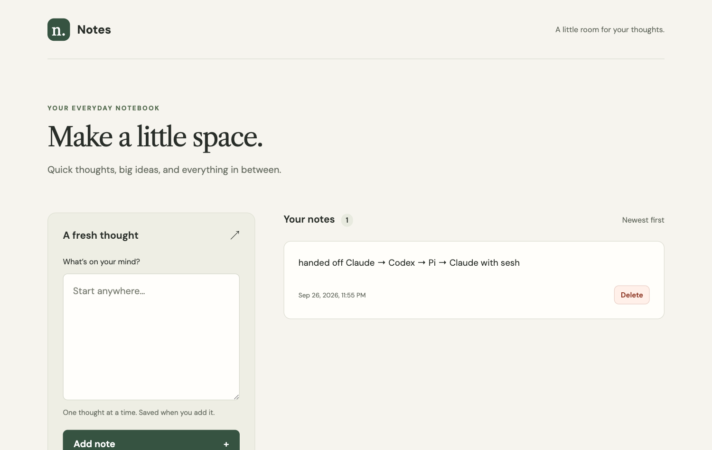

# sesh

Portable import and export for AI coding sessions.

## Install

Requires Go 1.26.6 or newer (older Go toolchains since 1.21 download it automatically).

```sh
go install github.com/mr-jones123/sesh/cmd/sesh@latest    # or @v0.2.0 for a specific release
sesh version
```

`go install` puts `sesh` in `$(go env GOPATH)/bin` (usually `~/go/bin`); add that directory to your `PATH` if `sesh` is not found. Or build from a clone with `go build ./cmd/sesh`.

Releases follow [Semantic Versioning](https://semver.org) and are listed in [CHANGELOG.md](CHANGELOG.md). Until 1.0.0, a minor version may change commands, flags, or the bundle format.

### Use it from an agent

The repository ships an [Agent Skill](skills/sesh/SKILL.md) that teaches Claude Code, Codex, Pi, and other agents to find their session file, export it, and hand it to another harness:

```sh
npx skills add mr-jones123/sesh --skill sesh
```

Then ask the agent, for example, "hand this session off to Codex".

## Try it

```sh
sesh list                                   # sessions recorded for this directory, newest first
sesh export -last                           # export the newest one → <harness>-<id>.sesh.json
sesh export 3636a042                        # or pick one by ID (or its first characters)
sesh import claude-3636a042.sesh.json
sesh convert --target pi --model openai-codex/gpt-5.6-sol claude-3636a042.sesh.json
pi --session claude-3636a042.pi.jsonl
sesh convert --target codex --install claude-3636a042.sesh.json
codex resume <printed session id>
sesh convert --target claude --install claude-3636a042.sesh.json
claude --resume <printed session id>        # from the session's workspace
```

`list` reads the sessions Claude Code (`~/.claude`), Codex (`~/.codex`), and Pi (`~/.pi/agent`) recorded, keeps those started in the current directory, and shows the first message you typed in each. `-all` lists every directory, `-harness` narrows to one harness, and `-n 0` shows every row.

`export` converts a Pi, Claude Code, or Codex JSONL transcript into a portable `.sesh.json` bundle, with secrets and personal paths redacted (see [Redaction](#redaction)). It takes a transcript path, a session ID or ID prefix, or `-last`; `-harness` picks the harness for a path or narrows an ID or `-last`. The source transcript is never modified.

A bundle (format version 2) holds two views of the session:

- `session.events`: the harness-neutral timeline of messages, reasoning, tool calls, tool results, and compaction summaries. Each tool result links to its call by ID, and `parent_id` links events into a tree.
- `raw_records`: every source line. With `--no-redact` they are byte-for-byte; redacted, only the replaced text inside JSON strings differs.

Harness bookkeeping records (Claude attachments, Codex `event_msg`, Pi model changes, ...) stay in `raw_records` only. Images are not yet extracted into the timeline. Version 1 bundles must be re-exported.

`import` validates and summarizes a local bundle.

## Hand off to another harness

`convert` writes a bundle as a native session for a target harness, so the conversation continues there. Targets: Pi, Codex, and Claude Code, from any of the three sources.

| Neutral action | Pi | Codex | Claude |
|---|---|---|---|
| shell | `bash` | `exec_command` | `Bash` |
| read | `read` | text (no read tool) | `Read` |
| write | `write` | `apply_patch` (Add File) | `Write` |
| edit | `edit` | `apply_patch` (Update File) | `Edit`, one per replacement |
| anything else (web search, MCP, subagents, ...) | text with its result | text with its result | text with its result |

- Only the active branch is written; abandoned rewinds are dropped.
- Reasoning from another model is dropped for Codex and Claude (their reasoning is encrypted or signed per provider). Pi converts foreign reasoning to text itself.
- Calls the source never answered (interrupted runs) get an explicit "no result recorded" result, since Codex and Claude reject unanswered calls.
- Relative file paths become absolute under the workspace for Claude, whose file tools require absolute paths.
- `--workspace dir` records a different working directory; Pi requires it to exist, and Claude files the session under it. `--model provider/id` sets the model Pi resumes with.
- Recorded tool calls are history: they are never run.
- An unredacted (`--no-redact`) Pi bundle converted back to Pi with no overrides is copied byte-for-byte.
- In a redacted bundle, `~` that starts a path in the workspace or a tool call becomes the home directory of whoever runs `convert`, so a session continues on another machine with the same layout under its home.

Pi opens any file with `pi --session <file>`, so nothing is installed. Codex and Claude resume sessions only by ID from their own directories, so `--install` writes the file there after a confirmation prompt (`--yes` skips it):

- Codex: `$CODEX_HOME/sessions/YYYY/MM/DD/rollout-<time>-<id>.jsonl` (default `~/.codex`). Codex registers the session itself on first resume.
- Claude: `$CLAUDE_CONFIG_DIR/projects/<workspace, non-alphanumerics as ->/<id>.jsonl` (default `~/.claude`). Run `claude --resume <id>` from that workspace.

Each conversion gets a new session ID and never overwrites an existing session.

## Example: one app, three agents

Claude Code, Codex, and Pi built this notes app together on a Linux VM, one step each, each continuing the previous agent's session through sesh:



| Step | Agent | Continued from | Built |
|---|---|---|---|
| 1 | Claude Code | a new session | Node server with no dependencies, `GET`/`POST /api/notes` |
| 2 | Codex | Claude's session | frontend "for the API described above", known only from Claude's history |
| 3 | Pi | Codex's session | deleting notes, and the server left running |
| 4 | Claude Code | Pi's session | README, after listing what each earlier step added, with its commit |

Each handoff is an export, a convert, and a resume:

```sh
# Claude → Codex
sesh export -output 1-claude.sesh.json ~/.claude/projects/-root-notes-app/<id>.jsonl
sesh convert --target codex --install --yes 1-claude.sesh.json
codex exec resume <printed id> "You are picking up this project. Build the frontend for the API described above."

# Codex → Pi (codex exec resume appends to the installed rollout)
sesh export -output 2-codex.sesh.json ~/.codex/sessions/YYYY/MM/DD/rollout-…-<id>.jsonl
sesh convert --target pi -output 2-codex.pi.jsonl 2-codex.sesh.json
pi --session 2-codex.pi.jsonl -p "You are step 3 of 3: add deleting a note."

# Pi → Claude (pi --session appends to that file; --harness because it is outside ~/.pi)
sesh export --harness pi -output 3-pi.sesh.json 2-codex.pi.jsonl
sesh convert --target claude --install --yes 3-pi.sesh.json
claude --resume <printed id> -p "From the history: what did each previous step add?"
```

Each export redacted the session (95, 41, and 18 replacements, mostly `/root` → `~`), and each convert turned `~` back into the working directory `/root/notes-app`. Every hop kept the messages, the tool calls with their results, and the working directory; reasoning was dropped going into Codex and Claude. The source session files were never changed.

## Redaction

Session transcripts contain prompts, source code, tool arguments, command output, local paths, and anything an agent read, including API keys and `.env` files. `export` replaces these in both the event timeline and the raw source lines, and prints how many it replaced per rule:

- API keys and tokens with a known format: OpenAI, Anthropic, GitHub, AWS, Google, Slack, Stripe, Hugging Face, npm, JWTs, bearer tokens, PEM private keys
- passwords in URLs (`postgres://user:[REDACTED:url-password]@host`) and upper-case `*_TOKEN=`, `*_SECRET=`, `*_PASSWORD=`, `*_API_KEY=` values
- email addresses
- home directories: `/Users/<name>`, `/home/<name>`, `/root`, `C:\Users\<name>` and encoded session directories like `-Users-<name>-` become `~`

```text
$ sesh export session.jsonl
exported 18 events to session.jsonl.sesh.json
redacted 89 matches
  home-path          78
  email              11
```

The rules are fixed regular expressions, so the same transcript always gives the same bundle. Placeholders such as `your-api-key` and references such as `process.env.API_KEY` are kept. Only JSON string contents change; every other byte of a raw line stays as it was. The bundle is marked `"redacted": true`, and `sesh import` shows it.

Known formats only: a key without a known prefix, a lower-case `password: hunter2`, a user name typed in prose, or text inside an image gets through. Review a bundle before sharing it.

`sesh export --no-redact` keeps everything, for a byte-exact bundle you do not share.

## Releasing

1. Add the release to [CHANGELOG.md](CHANGELOG.md) and set `metadata.version` in [skills/sesh/SKILL.md](skills/sesh/SKILL.md). Bump the minor version for new commands or flags, the patch version for fixes.
2. Tag it and push the tag. `go install …@latest` resolves to the newest tag, and `sesh version` reports it.
   ```sh
   git tag -a v0.2.0 -m v0.2.0 && git push origin v0.2.0
   ```
3. Publish the changelog section as a GitHub release: `gh release create v0.2.0 --title v0.2.0 --notes-file notes.md`.

## License

[MIT](LICENSE)
